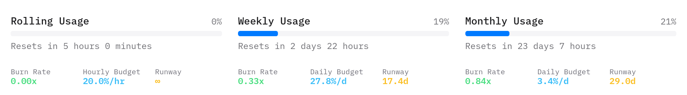

# OpenCode Go Usage Analytics

An inline analytics userscript for OpenCode Go usage limits. It automatically calculates and renders **Burn Rate**, **Budget/Pacing**, and **Runway** metrics directly below the native progress bars.

---

## ⚡ Quick Install

1. Make sure you have a userscript manager installed ([Tampermonkey](https://www.tampermonkey.net/) or [Violentmonkey](https://violentmonkey.github.io/)).
2. Click the link below to install:

**[Install Script Directly via GitHub Raw](https://raw.githubusercontent.com/jetjinser/opencode-go-analytics/master/opencode-go-analytics.user.js)**

---

## Features

- **Inline Display**: Integrates seamlessly with the OpenCode UI for **Rolling**, **Weekly**, and **Monthly** usage cards.
- **Zero Performance Impact**: Built with a debounced `MutationObserver` and strict DOM signature matching to prevent layout thrashing and infinite loops (fully compatible with Dark Reader).
- **Context-Aware Metrics**:
  - Automatically switches between **Hourly Budget** (for Rolling) and **Daily Budget** (for Weekly/Monthly).
  - Handles fractional time parsing (`days`, `hours`, `minutes`).

---

## Metrics Glossary

| Metric | Description |
| :--- | :--- |
| **Burn Rate** | Consumption speed relative to elapsed cycle time. • `< 0.85x`: Consuming slower than average (Green) • `0.85x - 1.05x`: On track (Gray) • `> 1.05x`: Consuming faster than average (Red) |
| **Budget / Pacing** | Max allowed usage percentage per hour/day (`%/hr` or `%/d`) to evenly distribute remaining capacity until reset. |
| **Runway** | Estimated time remaining (`d`, `h`, or `m`) before running out of quota if consumed at the current pace. |
